# Network SwiftUI 📱

A fully SwiftUI-based iOS networking layer with robust API handling, live image caching, and integrated Sentry logging for monitoring requests and errors. Designed to simplify API calls, provide detailed console logs, and handle errors gracefully.

## Features ✨
- [x] 🛜 **Connectivity-aware requests**: Handles online/offline scenarios automatically.
- [x] 📡 **Async/Await Networking**: Modern Swift concurrency support.
- [x] 📦 **Automatic JSON encoding/decoding**: Uses `Encodable` and `Decodable`.
- [x] 🖼 **Image caching**: Async image loading with in-memory caching.
- [x] 🚩 **Error handling**: Unified APIError mapping and logging.
- [x] 📝 **Sentry Integration**: Logs API calls, responses, and errors for monitoring.
- [x] 🔄 **Pull-to-refresh**: Built-in support for refreshing data in SwiftUI lists.
- [x] 🏁 **Pagination support**: Efficiently loads more data when scrolling.

<br>
<br>
<br>

## Code Example ⚡️

```swift
// View

struct ContentView: View {
    var body: some View {

      List(viewModel.list) { item in
      // ...
      }
      .refreshable { Task { await viewModel.fetchExample() } }
      .task { await viewModel.fetchExample() }
    }
}
```
```swift
// View Model

func fetchExample async {
  let result = await repo.fetchExample(params: _)

  switch result {
  case .success(let response):
    // ...
  case .failure(let error):
    // ...
  }
}
```


```swift
// Repository

class MyRepo: Repo {
    func fetchExample(params: Param) async -> Result<BaseResponse<[Model]>, APIError> {
        do {
            let response: BaseResponse<[Model]> = try await network.call(Service.getExample(params))
            return .success(response)
        } catch {
            return .failure(network.mapError(error))
        }
    }
}
```
```swift
// Service

enum Service: ServiceProtocol {
    case getExample(_ params: Param)
    var url: String { API.baseUrl }
    var path: String { "example" }
    var method: HTTPMethod { .GET }
    var parameters: Parameters? { params }
    var headers: Headers? { nil }
    var body: Encodable? { nil }
}
```

<br>
<br>
<br>

### Screenshot
#### Network
<p align="start">
  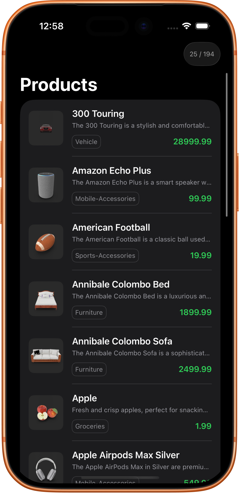
  &nbsp;&nbsp;&nbsp;
  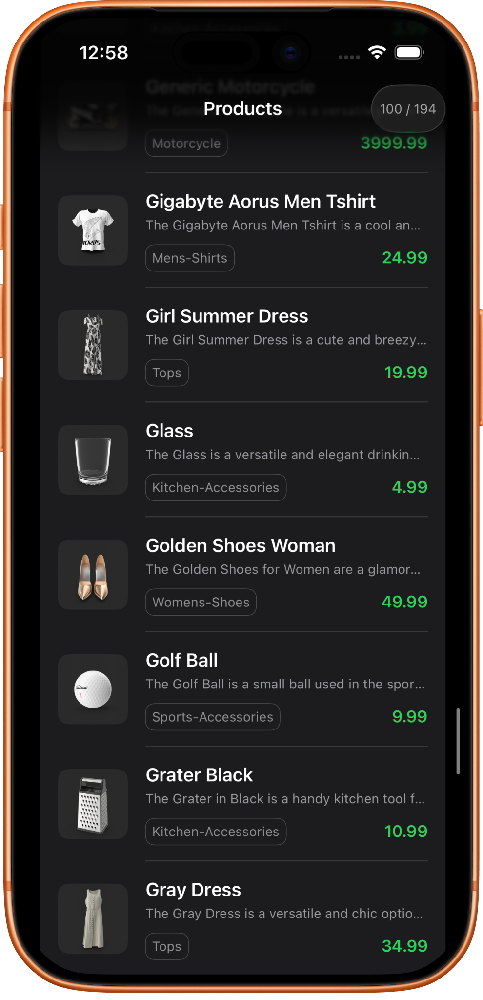
</p>


<br>
<br>
<br>


## Sentry Integration 🛜

All API calls, responses, and errors are automatically logged to **Sentry** via the `SentryManager`. This helps track:

- 🚀 API success/failure events
- 🕒 Request durations
- 🐞 Errors and backend failure messages
- 📦 Response payloads

This provides full observability for networking in production and development environments.

#### Sentry
<p align="start">
  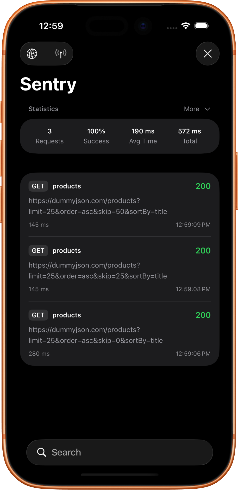
  &nbsp;&nbsp;&nbsp;
  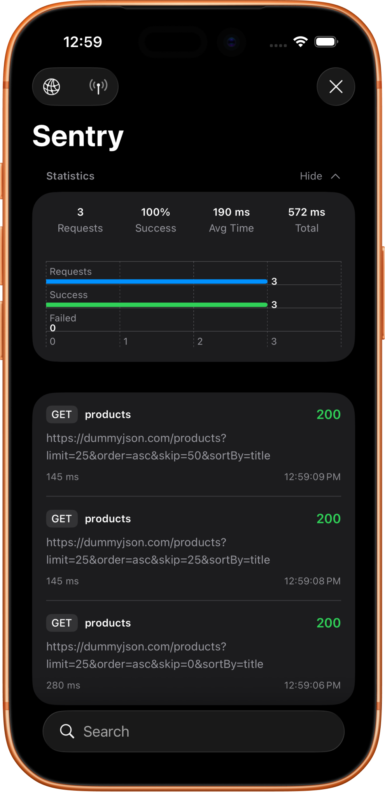
  &nbsp;&nbsp;&nbsp;
  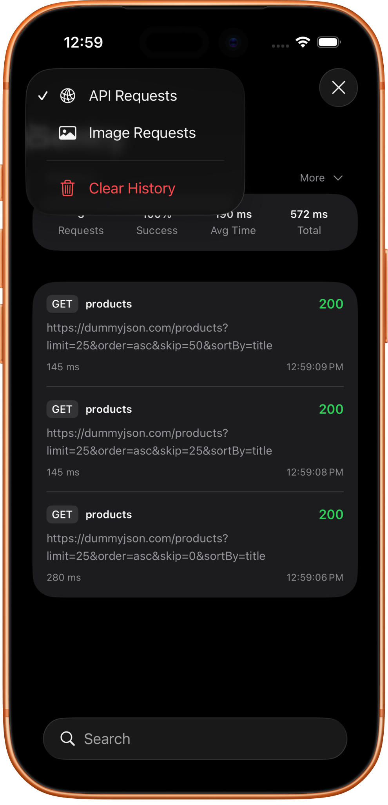
  &nbsp;&nbsp;&nbsp;
  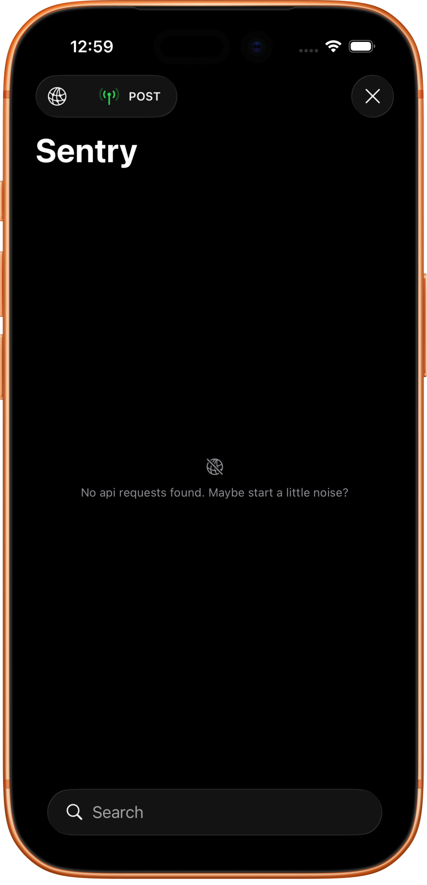
  &nbsp;&nbsp;&nbsp;
  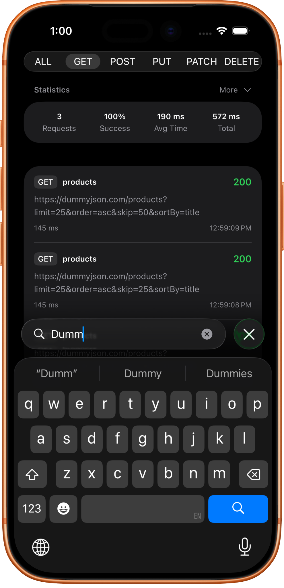
  &nbsp;&nbsp;&nbsp;
  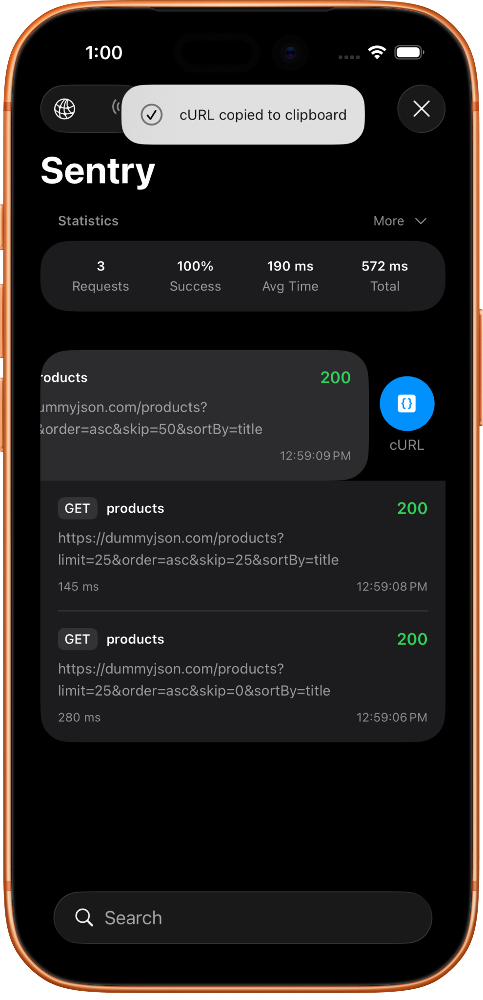
</p>

#### Images
<p align="start">
  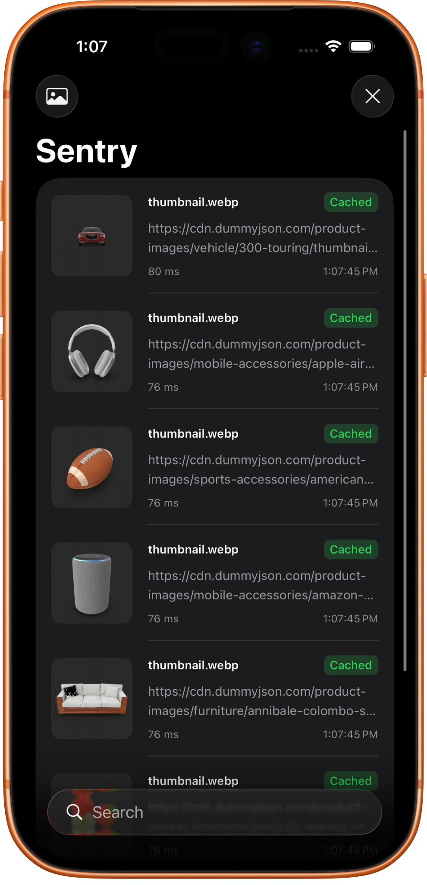
  &nbsp;&nbsp;&nbsp;
  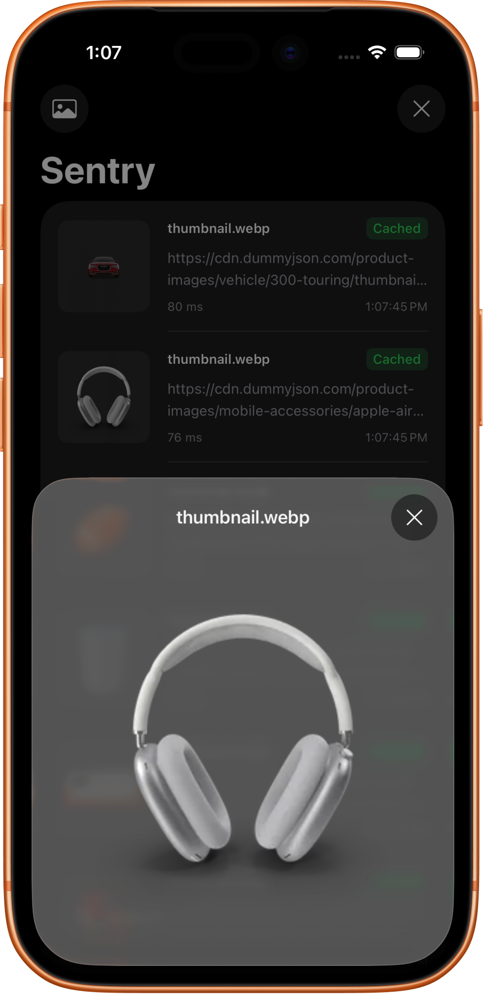
</p>

## Detail

#### Success
<p align="start">
  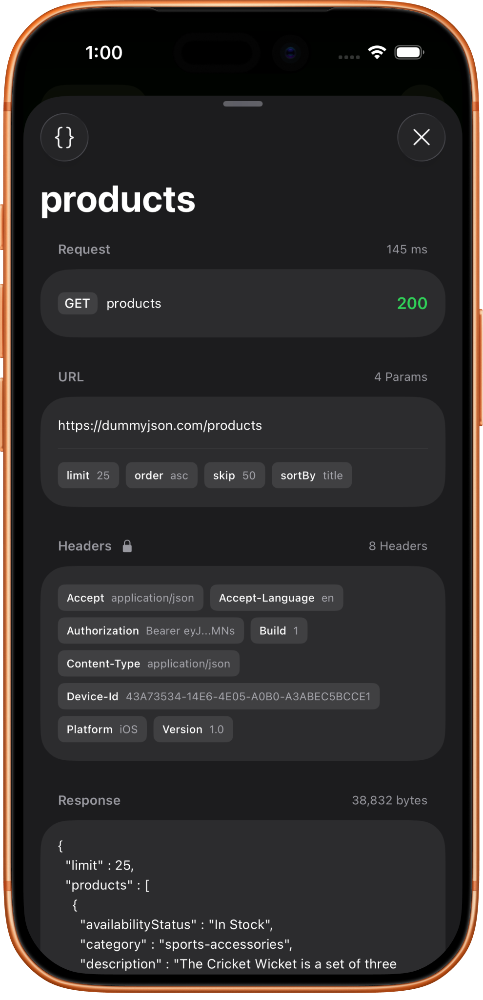
  &nbsp;&nbsp;&nbsp;
  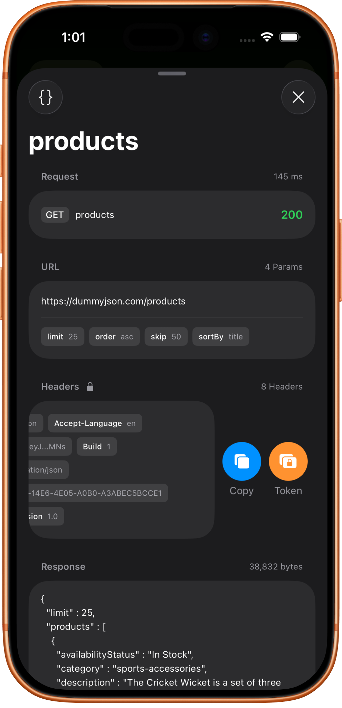
  &nbsp;&nbsp;&nbsp;
  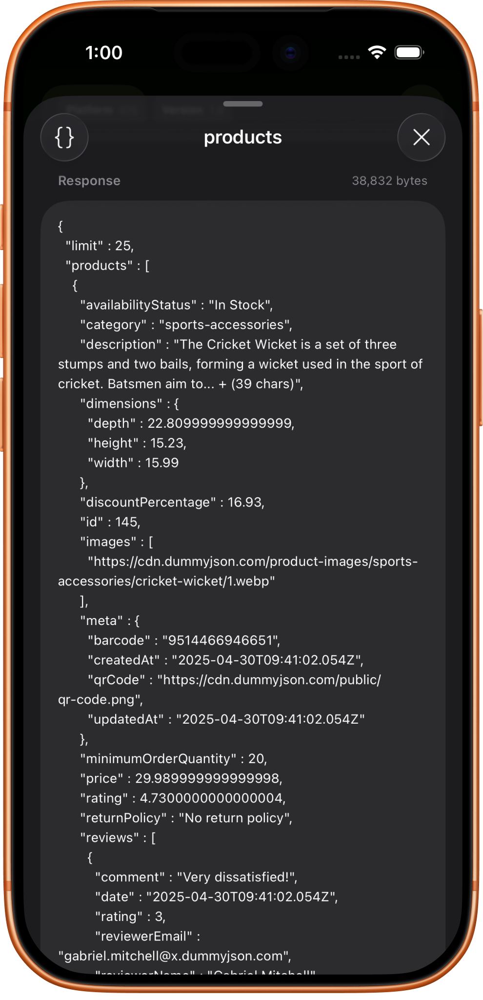
</p>

#### Failed
<p align="start">
  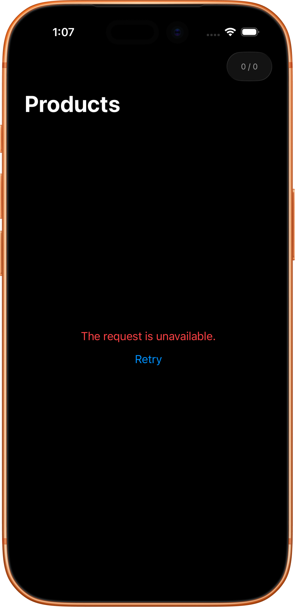
  &nbsp;&nbsp;&nbsp;
  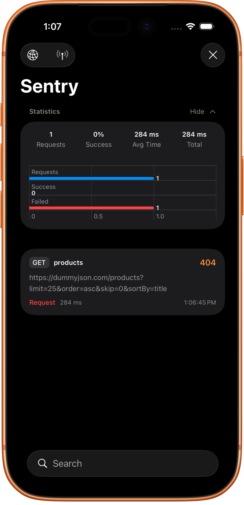
  &nbsp;&nbsp;&nbsp;
  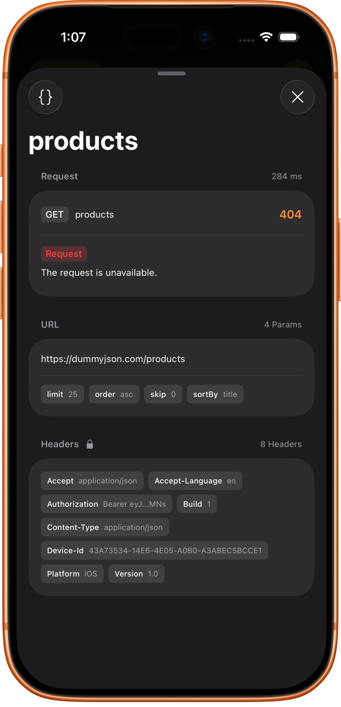
    &nbsp;&nbsp;&nbsp;
  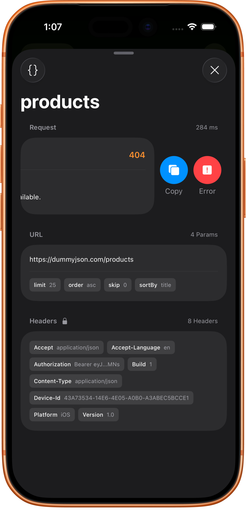
</p>


